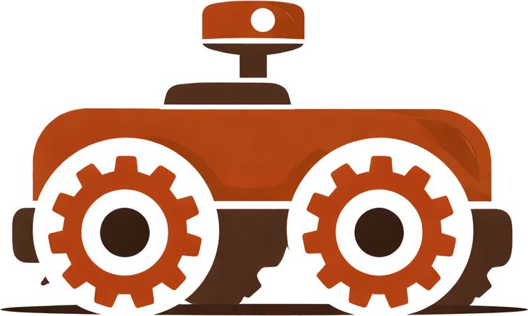

# Rust Robotics

<p align="center">
  
</p>

<p align="center">
  <a href="https://yongkyuns.github.io/sim-tutorial/">
    
  </a>
  <a href="https://yongkyuns.github.io/sim/">
    
  </a>
  <a href="https://github.com/yongkyuns/RustRobotics">
    
  </a>
  
</p>

Rust Robotics is a project with two practical goals:

1. build a reusable library of robotics algorithms
2. build an interactive simulation layer for learning, testing, and demonstration

The project is intentionally straightforward. It is not trying to be a large
framework or a research platform with every possible feature. The focus is on
clear implementations, portable runtime boundaries, and interactive experiences
that make the underlying algorithms easier to understand.

## Live Links

- Documentation site: <https://yongkyuns.github.io/sim-tutorial/>
- Full simulator: <https://yongkyuns.github.io/sim/>
- Control tutorial: <https://yongkyuns.github.io/sim-tutorial/tutorials/pendulum.html>
- Localization tutorial: <https://yongkyuns.github.io/sim-tutorial/tutorials/localization.html>
- Path planning tutorial: <https://yongkyuns.github.io/sim-tutorial/tutorials/path_planning.html>
- SLAM tutorial: <https://yongkyuns.github.io/sim-tutorial/tutorials/slam.html>
- Robot tutorial: <https://yongkyuns.github.io/sim-tutorial/tutorials/robot.html>

## What This Repository Is For

Rust Robotics is meant to be useful to both:

- students who want clear explanations and interactive examples
- engineers who want compact, readable implementations and practical tradeoff discussion

The main themes of the project are:

- control systems
- localization
- path planning
- SLAM
- robot runtime and policy execution

The documentation is meant to explain:

- what each algorithm is for
- what assumptions it makes
- where it is used
- how it compares to alternatives
- what it costs in compute and memory
- and how to interpret its behavior in the simulator

## Core Idea

The project is built around two connected ideas.

### Portable implementations

Algorithms should not be trapped inside one simulator or one UI surface. The
same core logic should be usable in:

- native applications
- web-based simulations
- interactive educational material
- and, where reasonable, more deployment-oriented contexts

### Interactivity as a teaching tool

Robotics concepts become much easier to learn when the behavior is visible. This
repository uses simulation not just as a demo layer, but as part of the
explanation:

- control becomes easier to understand when overshoot and settling are visible
- localization becomes easier to understand when uncertainty is visible
- planning becomes easier to compare when search effort and path quality are visible
- SLAM becomes easier to understand when drift and correction are visible

## What You Can Study Here

### Control systems

The inverted pendulum tutorial compares:

- PID
- LQR
- MPC
- PPO policies

This is the most compact place in the repo to compare classical and learned
control methods under a shared plant.

### Localization

The localization tutorial focuses on noisy sensing, motion uncertainty, and
particle-filter behavior. It is intended to make state estimation visible
instead of purely abstract.

### Path planning

The planning tutorial compares:

- Dijkstra
- A*
- Theta*
- RRT

This makes it easier to see the tradeoffs between graph search, heuristics,
any-angle methods, and sampling-based planning.

### SLAM

The SLAM tutorial focuses on joint pose and map estimation, drift accumulation,
and correction behavior. It is written to connect the math to what a reader can
actually observe in a live demo.

### Robot runtime

The robot tutorial connects simulation, observations, policy execution, and
actuation into a more realistic runtime loop. This is where the project moves
from toy examples toward a richer robot-control stack.

## Repository Layout

### `rust_robotics_algo`

Reusable robotics logic:

- control algorithms
- localization and SLAM
- planning methods
- shared robot-framework logic

### `rust_robotics_core`

Small shared crate for portable data exchanged across the workspace, including
policy snapshots and training metrics.

### `rust_robotics_train`

Training-side runtime and PPO implementation:

- rollout collection
- optimization
- model ownership
- export into portable snapshots

### `rust_robotics_sim`

Interactive application and world ownership:

- native and web simulator runtime
- egui / eframe app shell
- MuJoCo integration
- pendulum, localization, planning, SLAM, and robot demos

### `site_docs`

Authored documentation source for the GitHub Pages tutorial site.

### `docs`

Generated web bundle for the hosted simulator.

## Getting Started Locally

### Fastest route

Build the web simulator:

```bash
./build_web.sh --fast
./start_server.sh
```

Then open:

- simulator: `http://127.0.0.1:3000/`

If you also want the authored documentation site locally:

```bash
source /tmp/rust-robotics-docs-venv/bin/activate
./scripts/build_docs_site.sh
```

Then open the built HTML under:

- `site_docs/_build/html/`

### Useful reading order

If you are new to the project:

1. read the docs overview
2. start with the control tutorial
3. continue to localization
4. continue to path planning
5. then read SLAM
6. finish with the robot runtime tutorial

## Local Development Checks

### Core checks

```bash
cargo check -p rust_robotics_core
cargo check -p rust_robotics_algo
```

### Simulator checks

```bash
MUJOCO_HOME=/path/to/mujoco cargo check -p rust_robotics_sim
MUJOCO_HOME=/path/to/mujoco cargo test -p rust_robotics_sim --lib
```

### Web checks

```bash
cargo check -p rust_robotics_sim --target wasm32-unknown-unknown
node --check rust_robotics_sim/web/mujoco_runtime.js
./build_web.sh --fast
npm run test:web-smoke
```

## Native And Web Targets

The project is intentionally usable in both native and browser environments.

### Native

Native mode is the easiest place to use the full interactive app and the richer
MuJoCo-backed runtime.

### Web

The browser build exists for accessibility, education, and lightweight sharing.
The GitHub Pages deployment is structured so the tutorial site can embed focused
simulator views from the hosted simulator bundle.

## Documentation And Publishing

The simulator bundle and the tutorial site are built separately:

- simulator bundle: `docs/`
- tutorial site: `site_docs/_build/html/`

Helper script:

```bash
./scripts/publish_pages.sh --build
```

Default sync target:

- `~/Dev/me/blog/yongkyuns.github.io`

Default publish subdirectories:

- `sim/`
- `sim-tutorial/`

## Why Rust

Rust is useful here because the project wants explicit boundaries between:

- reusable algorithms
- training logic
- portable shared model/state representations
- interactive simulation runtime

It is also a good fit for a codebase that wants to stay close to runtime and
deployment concerns rather than only producing notebooks or one-off demos.

## Current Direction

The current documentation direction is:

- learning-first tutorials
- more explicit algorithm comparisons
- more complexity and memory discussion
- less focus on internal architecture for its own sake

If you want a place to start, use:

- docs homepage: <https://yongkyuns.github.io/sim-tutorial/>
- simulator: <https://yongkyuns.github.io/sim/>
