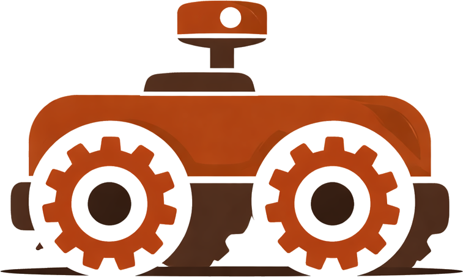

# Rust Robotics

<p align="center">
  
</p>

<p align="center">
  <a href="https://yongkyuns.github.io/sim-tutorial/">
    
  </a>
  <a href="https://yongkyuns.github.io/sim/">
    
  </a>
  <a href="https://github.com/yongkyuns/RustRobotics">
    
  </a>
  
</p>

Rust Robotics has two practical goals:

1. provide readable, reusable Rust implementations of robotics algorithms
2. make those algorithms easier to understand through interactive native and web simulations

The project focuses on control, localization, path planning, SLAM, and robot runtime execution. It
is intentionally not a giant robotics framework: the priority is clear implementations, explicit
runtime boundaries, numerical verification, and educational experiments that connect the math to
observable behavior.

## Live project

- Documentation: <https://yongkyuns.github.io/sim-tutorial/>
- Simulator: <https://yongkyuns.github.io/sim/>
- Control: <https://yongkyuns.github.io/sim-tutorial/tutorials/pendulum.html>
- Localization: <https://yongkyuns.github.io/sim-tutorial/tutorials/localization.html>
- Path planning: <https://yongkyuns.github.io/sim-tutorial/tutorials/path_planning.html>
- SLAM: <https://yongkyuns.github.io/sim-tutorial/tutorials/slam.html>
- Robot runtime: <https://yongkyuns.github.io/sim-tutorial/tutorials/robot.html>

## What the tutorials try to teach

The tutorial site is the explanatory layer above the Rust APIs. Each main chapter is intended to
connect four things:

- the mathematical problem and assumptions
- the concrete implementation used by this repository
- an interactive experiment in the simulator
- the compute, memory, numerical, and runtime tradeoffs that matter in practice

That distinction is important. When the current implementation differs from the idealized textbook
structure—for example, when sparse Graph SLAM assembly still ends in a dense solve—the tutorial
should say so explicitly.

## Repository layout

### `rust_robotics_algo`

Reusable robotics and robot-control logic:

- classical control
- particle-filter localization
- grid and sampling-based planning
- EKF and graph SLAM
- shared robot observation/action logic

The pure-algorithm versus robot-runtime dependency boundary is still being refined; algorithm-only
consumers should eventually be able to avoid inference/runtime dependencies entirely.

### `rust_robotics_core`

Small portable data types shared across runtime boundaries, including policy snapshots and training
metrics.

### `rust_robotics_train`

Training-side runtime and PPO implementation: rollout collection, optimization, model ownership, and
portable policy export.

### `rust_robotics_sim`

Native and web simulator runtime, egui/eframe application shell, MuJoCo integration, and the
interactive tutorial demos.

### `site_docs`

Authored Sphinx/MyST tutorial source.

### `docs`

Generated simulator web bundle used by the hosted demo.

## Start from a fresh checkout

The quickest interactive route is:

```bash
./build_web.sh --fast
./start_server.sh
```

Then open:

- <http://127.0.0.1:3000/>

`build_web.sh` checks the command-line tools it needs and reports missing prerequisites. For the
complete prerequisite list, see the documentation quickstart.

Build the authored tutorial site with:

```bash
./scripts/build_docs_site.sh
```

The script creates a repository-local `.venv-docs` environment when needed, installs
`site_docs/requirements.txt`, and builds Sphinx with warnings treated as errors. The result is under:

- `site_docs/_build/html/`

## Suggested reading order

1. Quickstart and project overview
2. Control systems
3. Localization
4. Path planning
5. SLAM
6. Robot runtime

The tutorials increasingly move from isolated algorithms toward complete runtime contracts.

## Development checks

Core crates:

```bash
cargo check -p rust_robotics_core
cargo check -p rust_robotics_algo
cargo test -p rust_robotics_algo
```

Numerical invariants:

```bash
cargo test -p rust_robotics_algo --test numerical_invariants
```

Formatting and linting:

```bash
cargo fmt --all -- --check
cargo clippy --workspace --all-targets -- -D warnings
```

Simulator, with MuJoCo installed:

```bash
MUJOCO_HOME=/path/to/mujoco cargo check -p rust_robotics_sim
MUJOCO_HOME=/path/to/mujoco cargo test -p rust_robotics_sim --lib
```

Web/browser checks:

```bash
cargo check -p rust_robotics_sim --target wasm32-unknown-unknown
node --check rust_robotics_sim/web/mujoco_runtime.js
node --check site_docs/_static/sim_embed.js
./build_web.sh --fast
npm ci
npm run test:web-smoke
```

Dependency audit:

```bash
cargo generate-lockfile
cargo audit
```

CI runs the native platform matrix, strict formatting/Clippy, documentation, numerical invariants,
browser smoke tests, and dependency auditing.

## Native and web targets

Native mode is the richest environment for interactive simulation and MuJoCo-backed robot work.
The browser build exists for education, lightweight sharing, and testing the same underlying Rust
logic in an accessible environment.

The tutorial site embeds focused simulator views from the hosted web bundle rather than maintaining
a separate implementation of each demonstration.

## Documentation and publishing

Simulator and tutorial output are built separately:

- simulator bundle: `docs/`
- tutorial site: `site_docs/_build/html/`

The publishing helper can rebuild and sync both into the Pages repository:

```bash
./scripts/publish_pages.sh --build
```

The default target remains `~/Dev/me/blog/yongkyuns.github.io`, with `sim/` and `sim-tutorial/`
subdirectories; use the script options or environment variables to override it.

## Why Rust

Rust fits this project because the codebase wants explicit boundaries between reusable algorithms,
training state, portable model/state representations, and simulator/runtime ownership. It also
keeps the project close to deployment and systems concerns instead of treating every algorithm as a
notebook-only demonstration.

## Current direction

Near-term work emphasizes:

- correctness and numerical invariants before adding more breadth
- guided, reproducible tutorial experiments
- explicit feature-maturity and implementation caveats
- cleaner algorithm/runtime dependency boundaries
- trustworthy native/web behavior under CI

Start at <https://yongkyuns.github.io/sim-tutorial/>.
